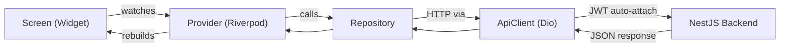

# Architecture Overview

> **Last updated:** 2026-03-12

## Overview

Talk & Earn is a Flutter application that lets users connect via text, voice, or video and earn coins for their time. The app is built with **Clean Architecture**, separating concerns into `core/` (shared infrastructure) and `features/` (domain-specific modules).

## Tech Stack

| Layer | Technology | Version |
|---|---|---|
| **Framework** | Flutter | SDK ^3.11.0 |
| **State Management** | Riverpod (annotation + generator) | ^3.2.1 / ^4.0.3 |
| **Navigation** | GoRouter | ^17.1.0 |
| **HTTP Client** | Dio | ^5.9.2 |
| **Models** | Freezed + json_serializable | ^3.2.5 / ^6.13.0 |
| **Token Storage** | flutter_secure_storage | ^10.0.0 |
| **Typography** | Google Fonts (Outfit) | ^8.0.2 |
| **Lint Rules** | very_good_analysis | ^10.0.0 |
| **Backend** | NestJS | — |

## Directory Structure

```
lib/
├── main.dart                  # App entry point
├── core/                      # Shared infrastructure
│   ├── api/                   # Dio client, endpoints, token storage
│   ├── config/                # Environment configuration
│   ├── router/                # GoRouter setup + route constants
│   ├── theme/                 # AppTheme, DesignConstants, AppStrings
│   ├── utils/                 # Shared utilities
│   └── widgets/               # GlassCard, AnimatedBackground, etc.
└── features/                  # Domain features
    ├── auth/                  # Login, Register, OTP verify
    ├── chat/                  # (Placeholder — future)
    ├── home/                  # Dashboard, matching interface
    ├── match/                 # Find/cancel match
    ├── moderation/            # (Placeholder — future)
    ├── profile/               # User profile management
    ├── rating/                # Post-session rating
    ├── settings/              # Account settings
    └── wallet/                # Balance, earn, withdraw
```

## Data Flow



## Feature Module Convention

Each feature follows this layout:

```
features/<name>/
├── models/           # Freezed data classes
├── repositories/     # API calls via ApiClient
├── providers/        # Riverpod Notifiers
└── presentation/     # Screens and widgets
```

**Rules enforced:**
- Widgets are always separate classes — never methods
- All strings come from `AppStrings`
- All spacing/colors come from `DesignConstants`
- API paths come from `ApiEndpoints`

## Key Design Decisions

| Decision | Rationale |
|---|---|
| Riverpod over BLoC | Less boilerplate, better code-gen support |
| GoRouter ShellRoute | Persistent bottom nav without rebuilding scaffold |
| Dio singleton | One interceptor handles all JWT token attachment |
| Freezed models | Immutable, union types, auto-generated JSON parsing |
| Dark glassmorphism | Matches legacy web app's premium design |
