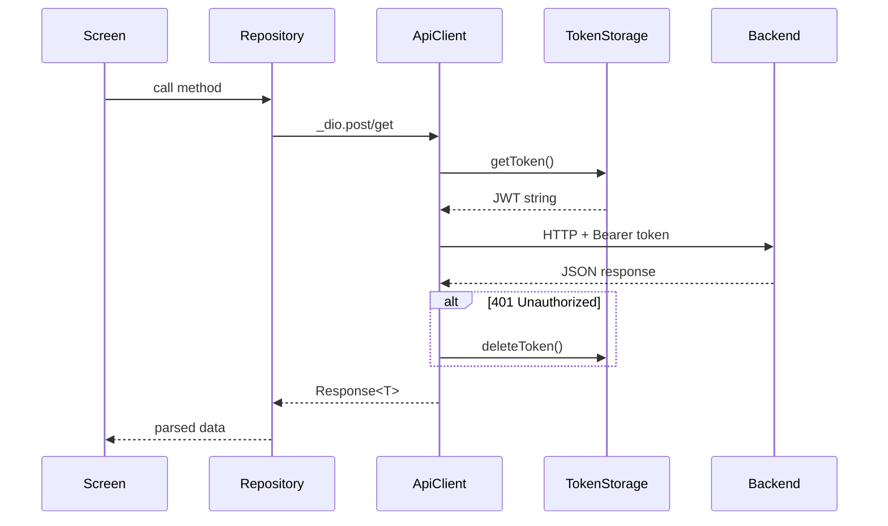

# Network Layer

> **Last updated:** 2026-03-12

## Overview

The network layer provides a centralized HTTP client for all API communication. It handles base URL resolution, JWT token injection, timeout configuration, and automatic token cleanup on 401 responses.

## Key Components

| File | Class | Purpose |
|---|---|---|
| `core/api/api_client.dart` | `ApiClient` | Dio singleton with interceptors |
| `core/api/api_endpoints.dart` | `ApiEndpoints` | Centralized endpoint constants |
| `core/api/token_storage.dart` | `TokenStorage` | FlutterSecureStorage wrapper |
| `core/config/app_config.dart` | `AppConfig` | URLs and timeout configuration |

## ApiClient

A lazy singleton Dio instance created once and reused globally.

```dart
// Usage in any repository:
final Dio _dio = ApiClient.client;
final response = await _dio.get<Map<String, dynamic>>(ApiEndpoints.profileMe);
```

### Interceptors

**Request Interceptor** — Automatically attaches the JWT Bearer token:
```dart
onRequest: (options, handler) async {
  final token = await TokenStorage.getToken();
  if (token != null) {
    options.headers['Authorization'] = 'Bearer $token';
  }
  return handler.next(options);
}
```

**Error Interceptor** — Clears the token on 401 Unauthorized:
```dart
onError: (e, handler) async {
  if (e.response?.statusCode == 401) {
    await TokenStorage.deleteToken();
  }
  return handler.next(e);
}
```

### Base URL Resolution

| Platform | URL | Source |
|---|---|---|
| Android emulator | `http://10.0.2.2:3000` | `AppConfig.mobileApiUrl` |
| Desktop / iOS | `http://localhost:3000` | `AppConfig.desktopApiUrl` |
| Web | `''` (proxy) | `AppConfig.webApiUrl` |

Resolved at runtime via `kIsWeb` check.

### Timeouts

| Setting | Value |
|---|---|
| Connect timeout | 10 seconds |
| Receive timeout | 10 seconds |

## API Endpoints

All endpoints are defined as `static const String` in `ApiEndpoints`:

| Domain | Endpoint | Path |
|---|---|---|
| **Auth** | `login` | `/auth/token` |
| | `register` | `/auth/register` |
| | `verifyEmail` | `/auth/verify-email` |
| **Profile** | `profileMe` | `/profile/me` |
| | `profileUpdate` | `/profile/update` |
| | `profilePicture` | `/profile/picture` |
| | `profileChangePassword` | `/profile/change-password` |
| | `profileDeleteAccount` | `/profile/delete-account` |
| | `profileAvatars` | `/profile/avatars` |
| **Wallet** | `walletBalance` | `/wallet/balance` |
| | `walletWithdraw` | `/wallet/withdraw` |
| | `walletEarn` | `/wallet/earn` |
| **Match** | `matchFind` | `/match/find` |
| | `matchCancel` | `/match/cancel` |
| **Rating** | `ratingSubmit` | `/rating/submit` |

## TokenStorage

Wraps `FlutterSecureStorage` with three static methods:

```dart
await TokenStorage.saveToken(token);    // Store JWT
final token = await TokenStorage.getToken(); // Retrieve JWT (nullable)
await TokenStorage.deleteToken();        // Clear JWT (logout)
```

## Diagram


