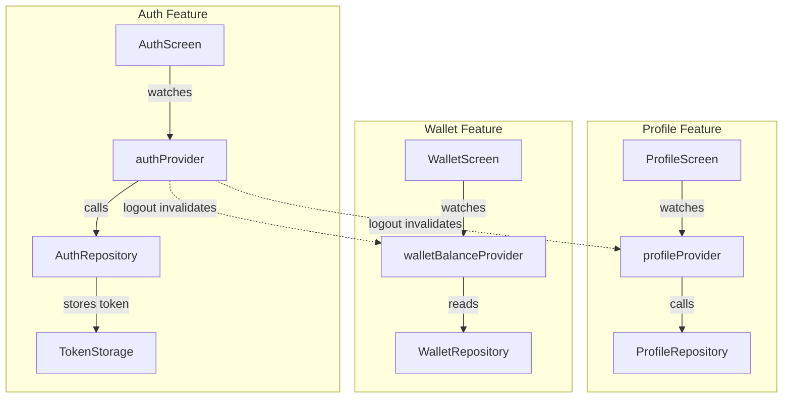

# State Management

> **Last updated:** 2026-03-12

## Overview

State is managed with **Riverpod** using two patterns: code-generated `@riverpod` Notifiers (for complex features) and manual `Provider` / `FutureProvider` (for simpler cases).

## Provider Patterns

### 1. Code-Generated AsyncNotifier (Auth, Profile, Match)

Used when the provider has multiple methods that mutate state.

```dart
@riverpod
class Auth extends _$Auth {
  final _repository = AuthRepository();

  @override
  FutureOr<User?> build() async {
    // Initial load — check token, fetch user
  }

  Future<void> login(String email, String password) async {
    state = const AsyncValue.loading();
    // ...
    state = AsyncValue.data(user);
  }
}
```

**Files using this pattern:**
| Provider | State Type | File |
|---|---|---|
| `authProvider` | `AsyncValue<User?>` | `auth/providers/auth_provider.dart` |
| `profileProvider` | `AsyncValue<User?>` | `profile/providers/profile_provider.dart` |
| `matchProvider` | `AsyncValue<MatchState>` | `match/providers/match_provider.dart` |

### 2. Manual Provider + FutureProvider (Wallet, Rating)

Used for simple read-only or single-action cases.

```dart
final walletRepositoryProvider = Provider((ref) => WalletRepository());

final walletBalanceProvider = FutureProvider.autoDispose<int>((ref) async {
  final repository = ref.watch(walletRepositoryProvider);
  return repository.getBalance();
});
```

**Files using this pattern:**
| Provider | State Type | File |
|---|---|---|
| `walletBalanceProvider` | `AsyncValue<int>` | `wallet/providers/wallet_provider.dart` |
| `ratingRepositoryProvider` | `RatingRepository` | `rating/providers/rating_provider.dart` |

## State Flow Diagram



## Consuming State in UI

All screens use `ConsumerWidget` or `ConsumerStatefulWidget`:

```dart
class ProfileScreen extends ConsumerWidget {
  @override
  Widget build(BuildContext context, WidgetRef ref) {
    final profileAsync = ref.watch(profileProvider);

    return profileAsync.when(
      loading: () => const CircularProgressIndicator(),
      error: (e, _) => ErrorWidget(e),
      data: (user) => ProfileContent(user: user),
    );
  }
}
```

## Error Handling Convention

All providers follow the same pattern:
1. Set `state = AsyncValue.loading()`
2. Try the operation
3. On success: `state = AsyncValue.data(result)`
4. On failure: `state = AsyncValue.error(e, st)` + `rethrow`

## Adding a New Provider

1. Create `features/<name>/providers/<name>_provider.dart`
2. Choose pattern:
   - **Multiple mutations** → `@riverpod class` (code-gen)
   - **Read-only / single action** → manual `FutureProvider`
3. Run `dart run build_runner build` after code-gen changes
4. Consume with `ref.watch(provider)` in widgets
