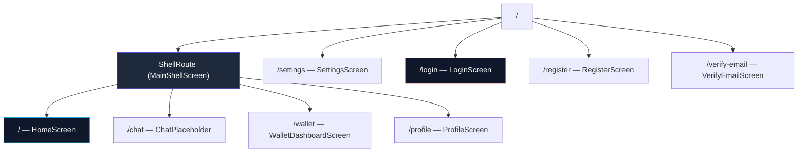

# Route Implementation

> **Last updated:** 2026-03-12

## Overview

Navigation uses **GoRouter** with a `ShellRoute` for the main dashboard tabs and standalone routes for auth screens and settings. An async redirect guard ensures unauthenticated users are bounced to login.

## Key Components

| File | Purpose |
|---|---|
| `core/router/app_router.dart` | GoRouter instance with all route definitions |
| `core/router/app_routes.dart` | Route path constants (`AppRoutes`) |

## Route Map



## Route Constants

```dart
class AppRoutes {
  // Shell routes (persistent bottom nav)
  static const String home = '/';
  static const String chat = '/chat';
  static const String wallet = '/wallet';
  static const String profile = '/profile';

  // Standalone routes (full-screen, no nav bar)
  static const String settings = '/settings';
  static const String login = '/login';
  static const String register = '/register';
  static const String verifyEmail = '/verify-email';
}
```

## Auth Guard (Redirect)

The router's `redirect` callback runs before every navigation:

| Condition | Action |
|---|---|
| No token + navigating to non-auth page | Redirect to `/login` |
| Has token + navigating to auth page | Redirect to `/` (home) |
| Otherwise | Allow navigation |

```dart
redirect: (context, state) async {
  final token = await TokenStorage.getToken();
  final isGoingToAuth = [login, register, verifyEmail].contains(state.matchedLocation);

  if (token == null && !isGoingToAuth) return AppRoutes.login;
  if (token != null && isGoingToAuth) return AppRoutes.home;
  return null;
}
```

## Shell vs Standalone

| Type | Navigator Key | Has Bottom Nav? | Examples |
|---|---|---|---|
| **Shell routes** | `_shellNavigatorKey` | ✅ Yes | Home, Chat, Wallet, Profile |
| **Standalone routes** | `_rootNavigatorKey` | ❌ No | Login, Register, Settings |

The `MainShellScreen` wraps shell routes with a `BottomNavigationBar` (mobile) or `NavigationRail` (desktop), providing persistent navigation without rebuilding the scaffold.

## Adding a New Route

1. Add the path to `AppRoutes`:
   ```dart
   static const String newPage = '/new-page';
   ```

2. Add the `GoRoute` to `app_router.dart`:
   - **Inside `ShellRoute.routes`** if it needs the bottom nav
   - **At root level with `parentNavigatorKey: _rootNavigatorKey`** if full-screen

3. Navigate using:
   ```dart
   context.go(AppRoutes.newPage);   // Replace
   context.push(AppRoutes.newPage); // Push on stack
   ```
